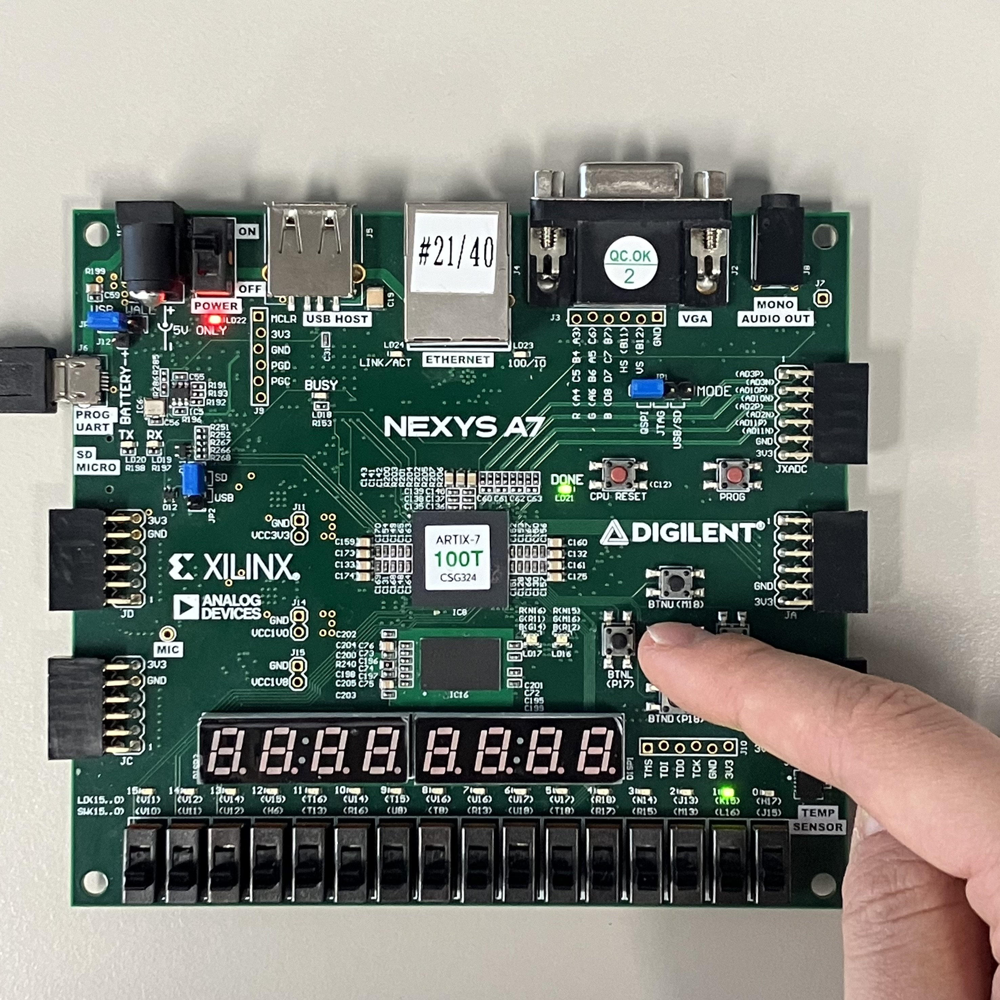
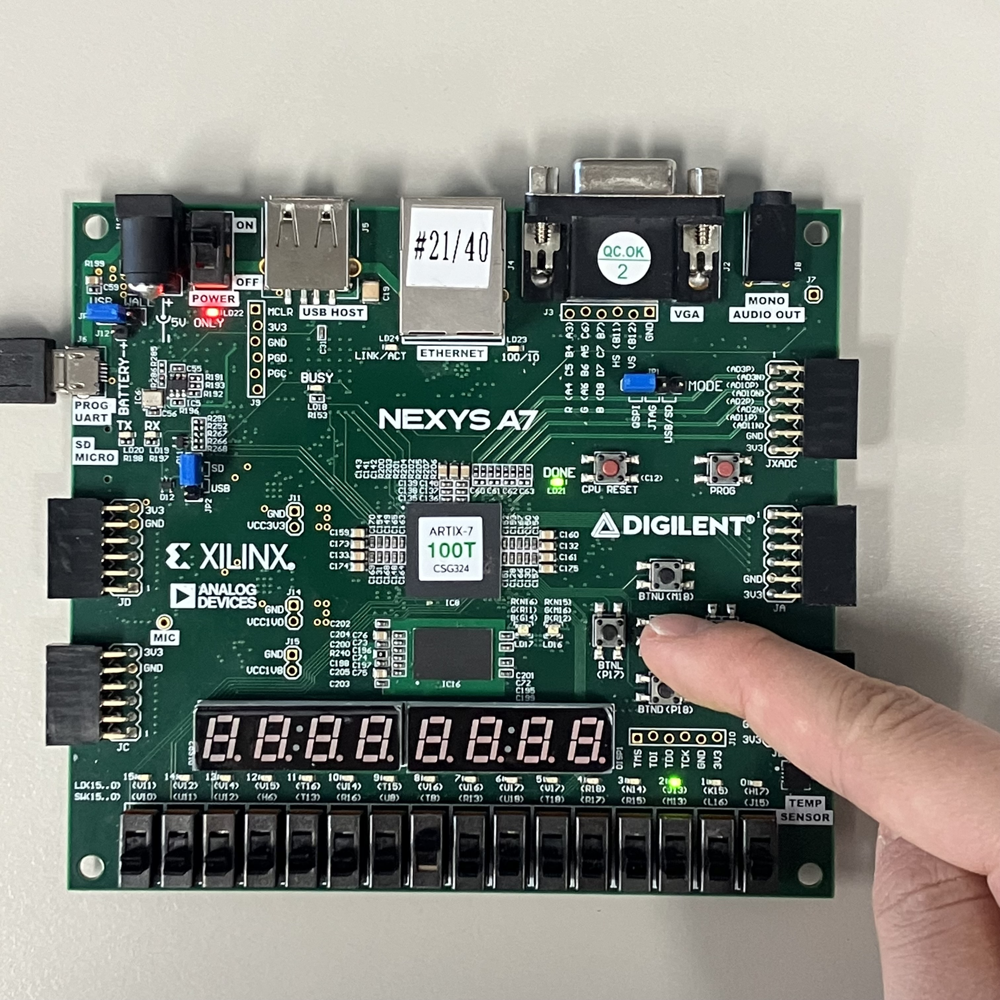
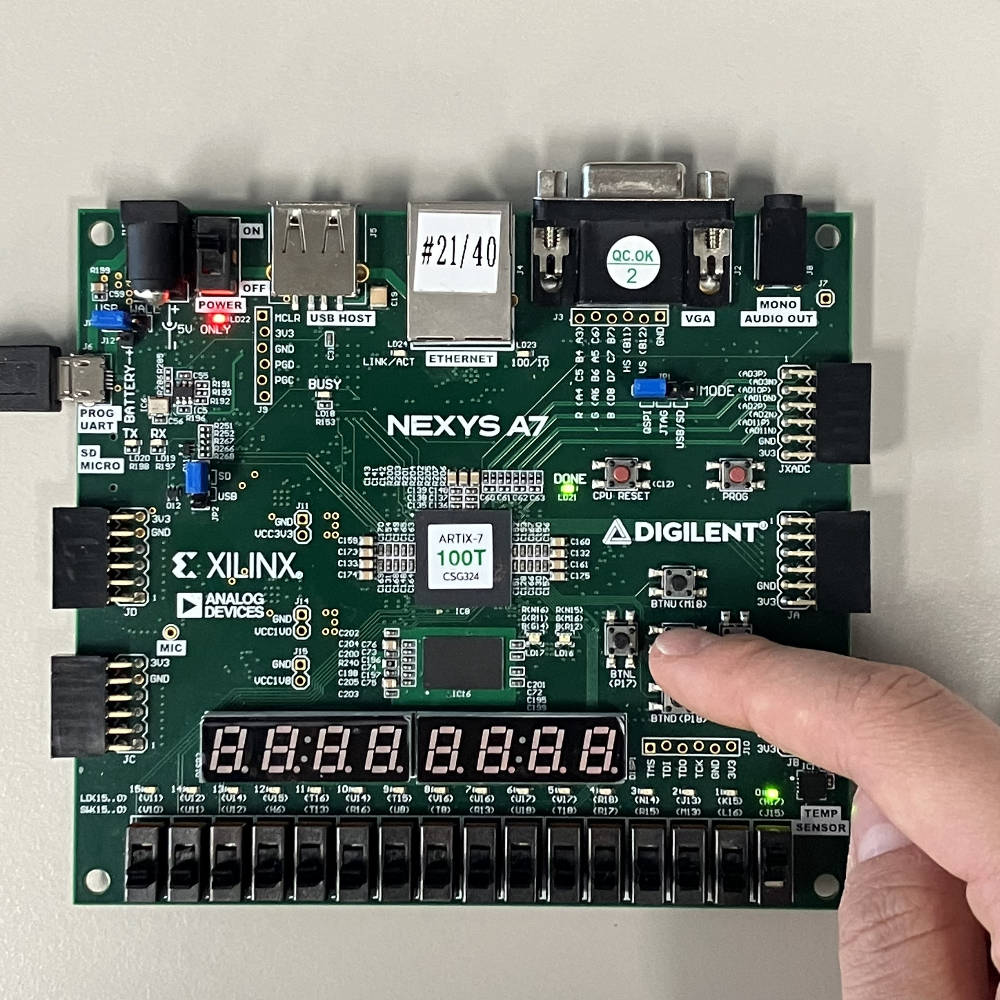

# Lab02_4bitComparator
다음은 빼기 연산을 통해 8bit A, B 값을 비교한다.
(쉽게는 연산자를 사용하는 방법도 있다 - EightbitComparator.v를 참고)

xdc 파일을 참고하면,

input
sw[7:0]: B
sw[15:8]: A

A와 B의 결과 값을 비교하여 A가 더 크면 GT(led[2])=1, 같은 값이면 EQ(led[1])=1, B가 더 크면 LT(led[0])=1이 된다.

