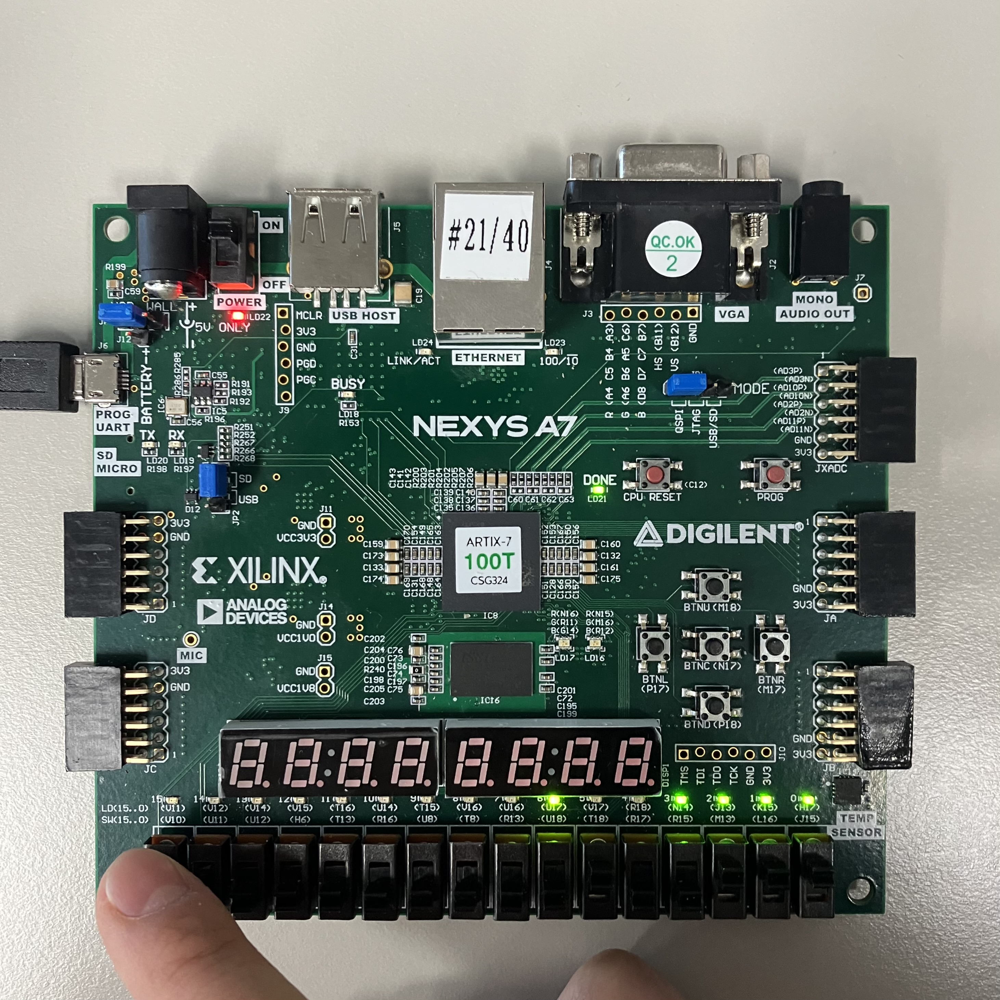
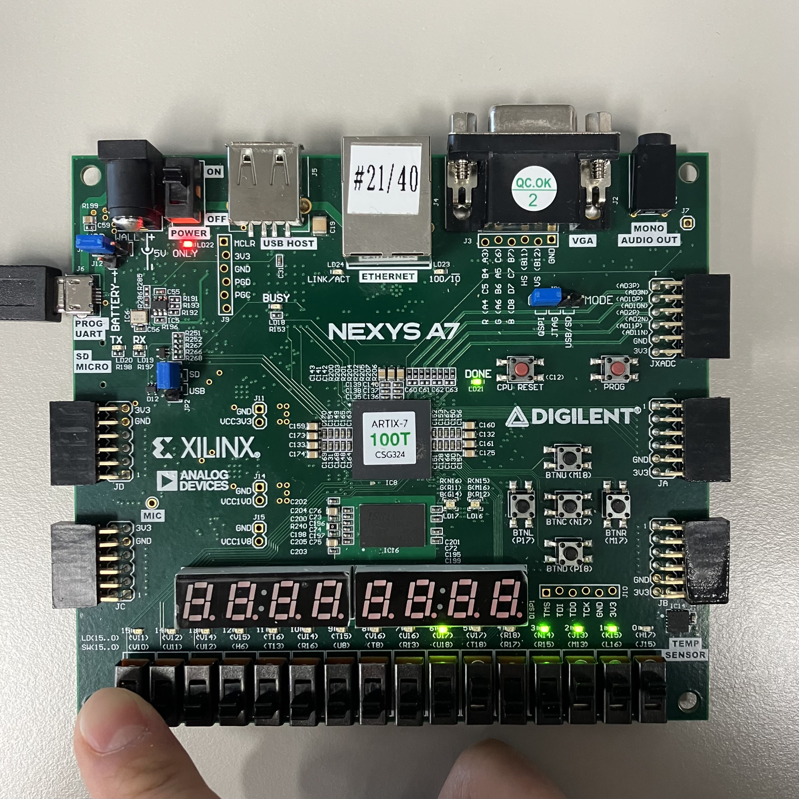

# Lab03_ParityGenerator
다음은 Parity bit를 연산하는 코드이다.
(bitwise 연산 xor를 통해 구현)

패리티 비트는 홀수 패리티 비트와 짝수 패리티 비트로 나뉘는데, 짝수 패리티 비트는 0과 1중 1이 짝수게 되도록 비트를 추가하는 것을 의미하고 홀수 패리티 비트는 0과 1중 1이 홀수가 되도록 비트를 추가하는 것이다.

xdc 파일을 참고하면,

input
sw[6:0]: data
sw[15]: PRT(parity bit)

짝수(even) 패리티는 전체 비트에서 1의 개수가 짝수가 되도록 패리티 비트를 정하는 것인데, 이를테면 데이터 비트에서 1의 개수가 홀수이면 패리티 비트를 1로 정한다.

홀수(odd) 패리티는 전체 비트에서 1의 개수가 홀수가 되도록 패리티 비트를 정하는 방법이다.

