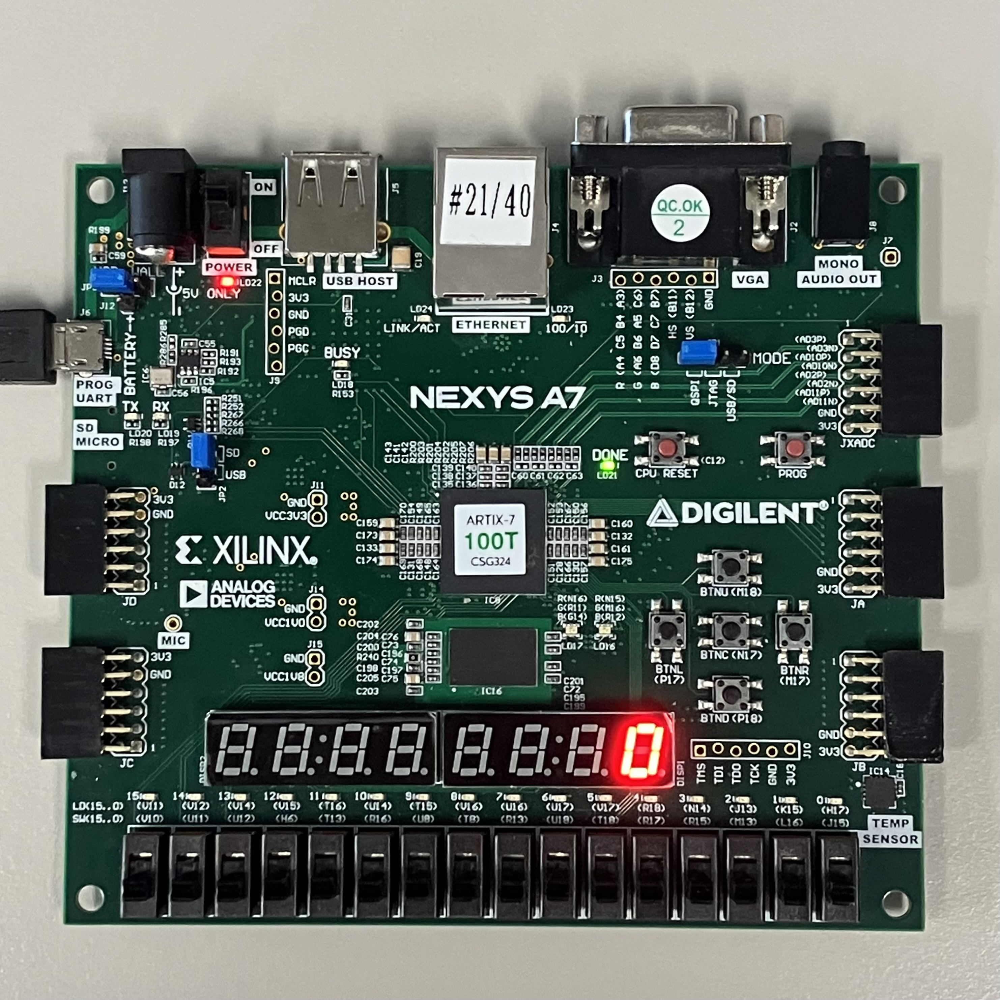

# Lab04_SevenSegmentDecoder
다음은 Switch로 입력받은 4bit 데이터의 수만큼 7segment display에 출력하는 코드이다.

***
xdc 파일을 참고하면,

### #input

sw[3:0]: sw

### #output

dp: decimal point (active-low)

seg[6:0]: 7-segment display (active-low)

이 변수는 하나의 7segment display에 어디를 키고 끌 것인지 정한다.

an[7:0]: anode signal (active-low)

이 변수는 여러 개의 7segment display 중 어떠한 것을 킬 것인지 정한다.

