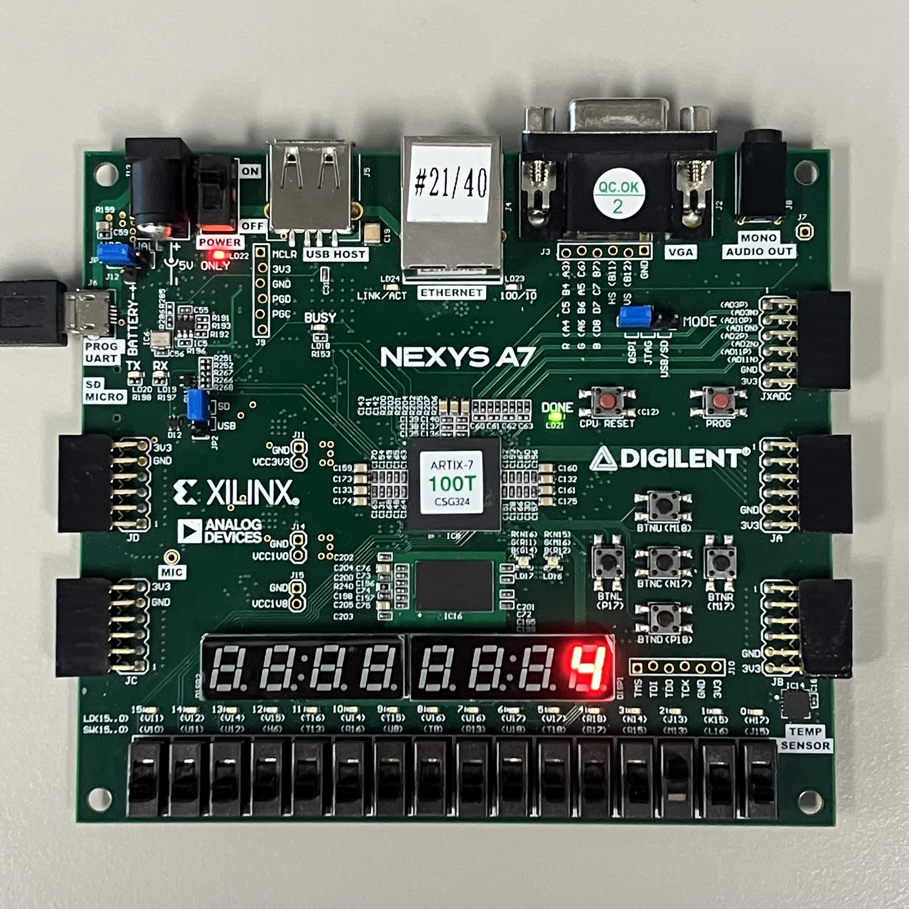

# Lab06_BCDCounter
다음은 0~9까지의 counter 코드이다. clock 신호에 맞춰 수를 증가시키다가 9 이후로 다시 0으로 reset 된다.

xdc 파일을 참고하면,

input
btnc: reset
clk: clock

output
DP: decimal point (active-low)
CA-CG: 7-segment display (active-low)
    이 변수는 하나의 7segment display에 어디를 키고 끌 것인지 정한다.
AN[7:0]: anode signal (active-low)
    이 변수는 여러 개의 7segment display 중 어떠한 것을 킬 것인지 정한다.

