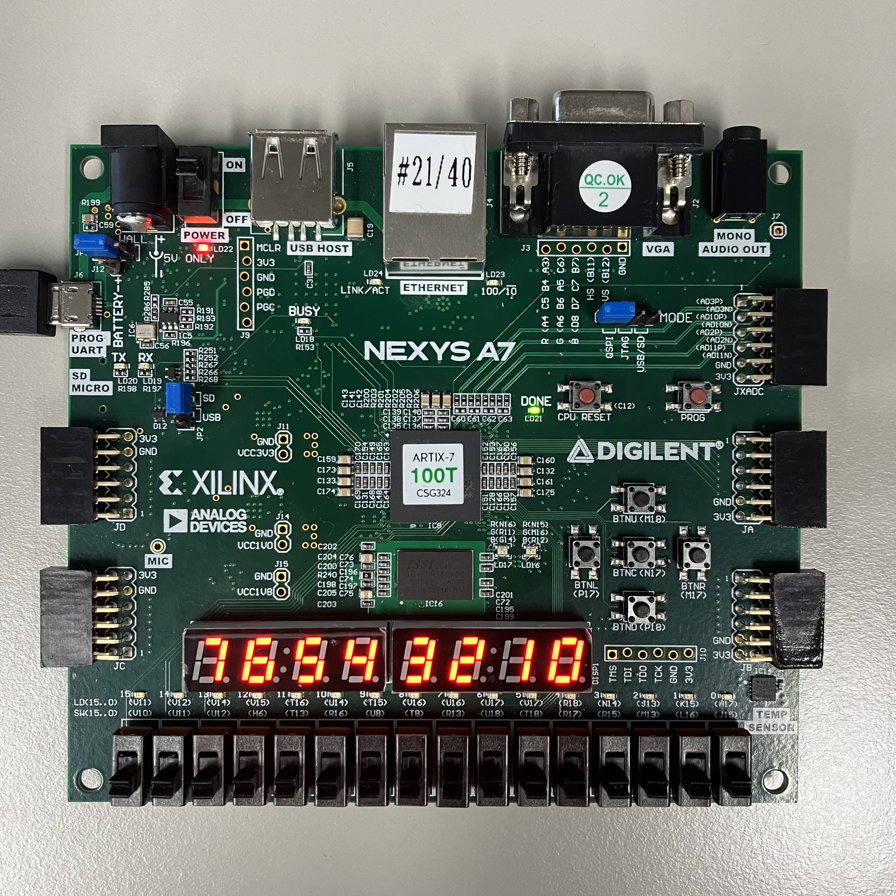
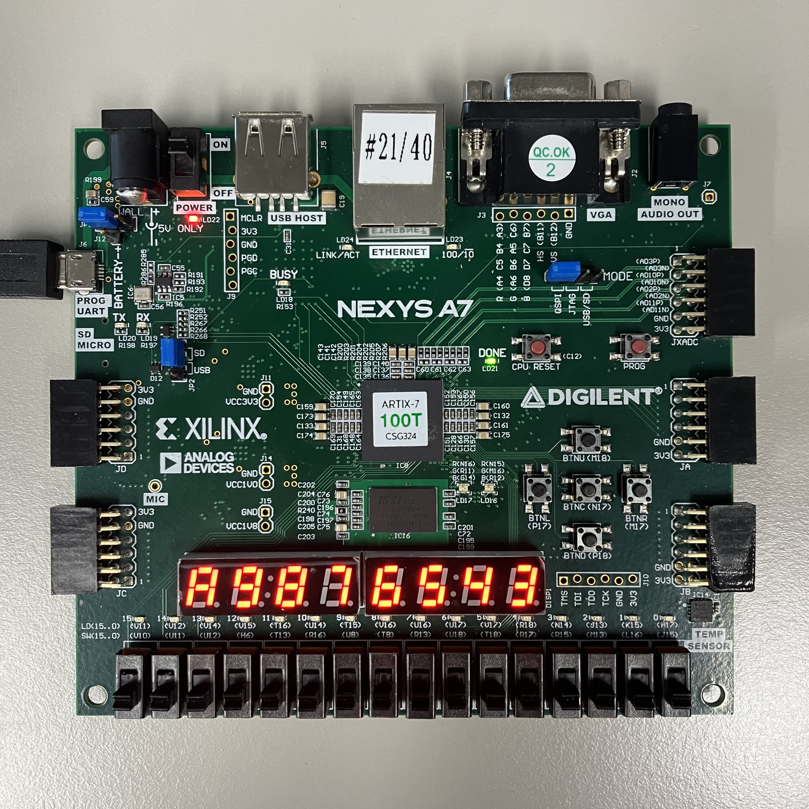

# Lab07_BCDCounter_7segment
다음은 0-9까지의 counter 코드이다.(이 코드에는 9 이상의 값도 출력하기 위해 a-f 값도 포함시켰다.) clock 신호에 맞춰 수를 증가시키다가 9 이후로 다시 0으로 reset 된다. 동시에 clock 신호에 따라 an가 한 칸씩 이동한다.

***
xdc 파일을 참고하면,

### #input

btnc: reset

CLK100MHZ: clock

### #output

DP: decimal point (active-low)

CA-CG: 7-segment display (active-low)

이 변수는 하나의 7segment display에 어디를 키고 끌 것인지 정한다.

AN[7:0]: anode signal (active-low)

이 변수는 여러 개의 7segment display 중 어떠한 것을 킬 것인지 정한다.

