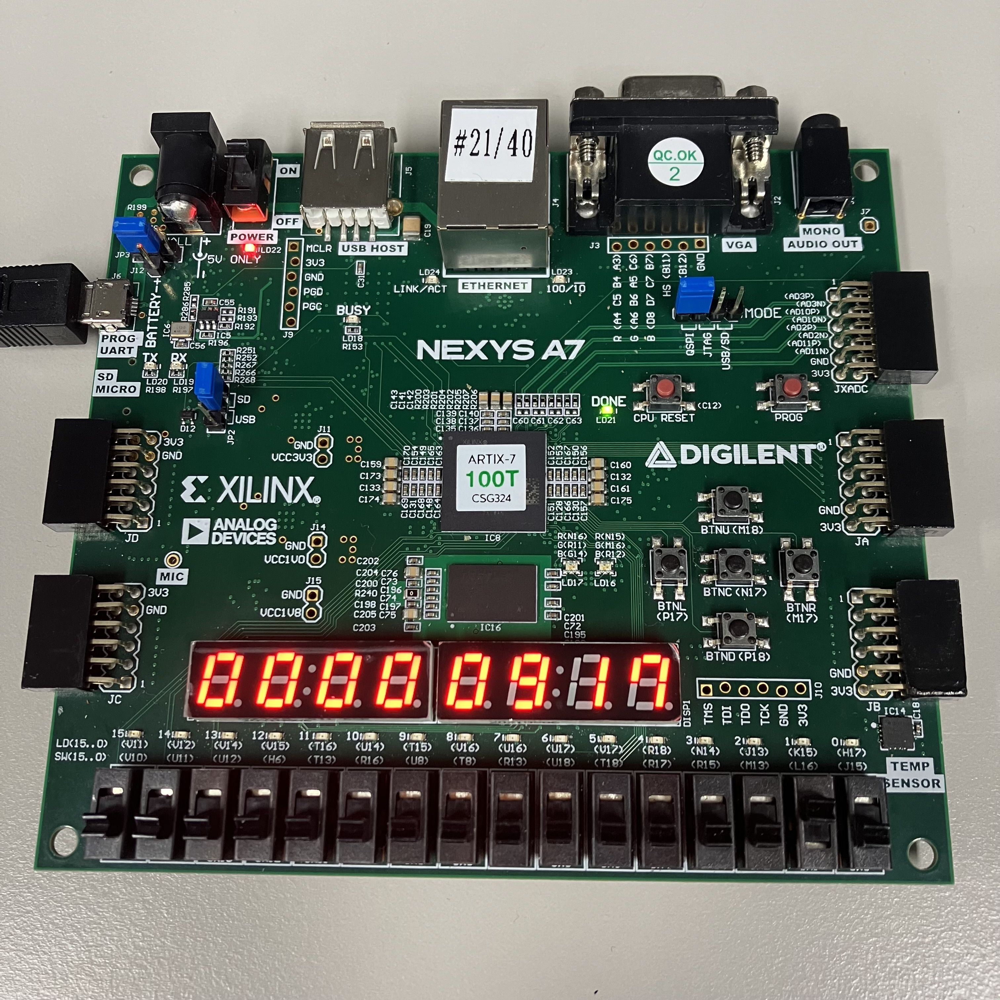

# Lab08_StopWatch
다음은 BCD counter를 이용하여 초, 분, 시간을 표시한다.

xdc 파일을 참고하면,

input

btnc: reset

btnd: state 동작 신호

CLK100MHZ: clock

output

DP: decimal point (active-low)

CA-CG: 7-segment display (active-low)

    이 변수는 하나의 7segment display에 어디를 키고 끌 것인지 정한다.

AN[7:0]: anode signal (active-low)

    이 변수는 여러 개의 7segment display 중 어떠한 것을 킬 것인지 정한다.

