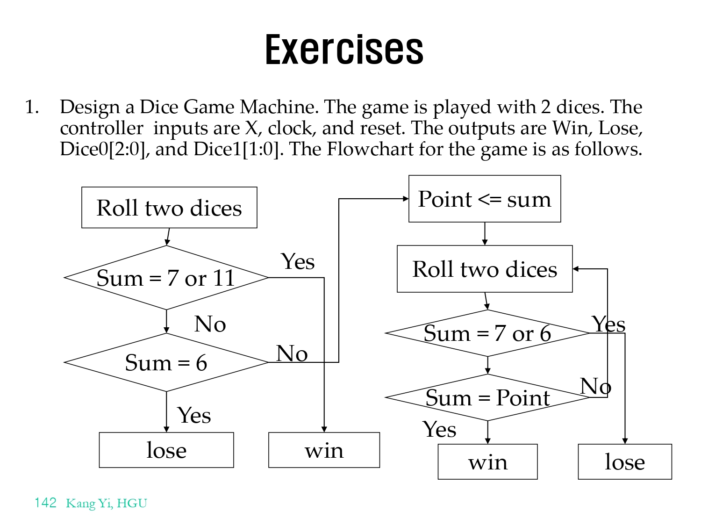
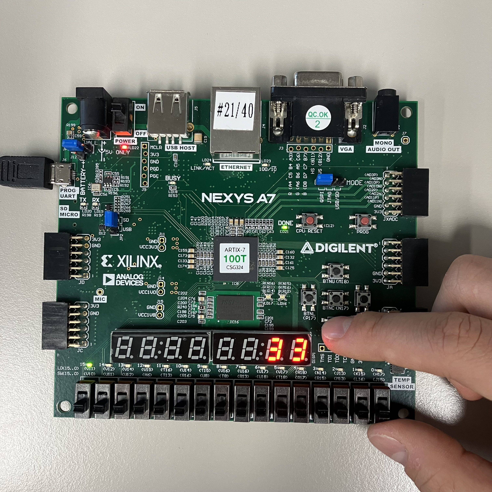
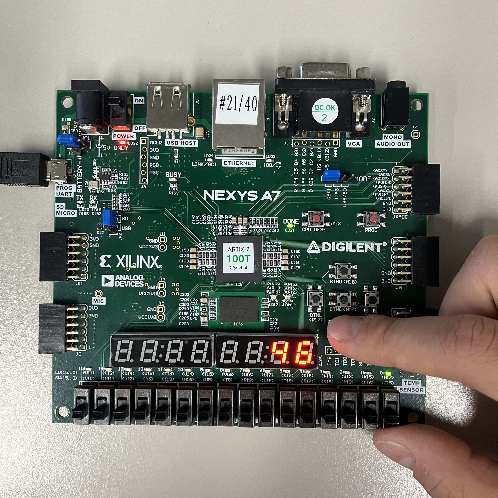
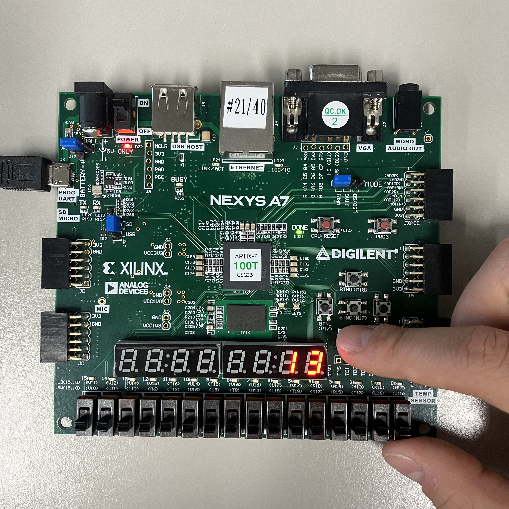

# Lab09_DiceGame
다음은 Dice Game 코드이다.
(작동 방식은 아래의 사진을 참고.)

xdc 파일을 참고하면,

input
btnc: reset
btnd: roll
clk: clock

output
led[0]: win
led[15]: lose
DP: decimal point (active-low)
sseg[6:0]: 7-segment display (active-low)
    이 변수는 하나의 7segment display에 어디를 키고 끌 것인지 정한다.
AN[7:0]: anode signal (active-low)
    이 변수는 여러 개의 7segment display 중 어떠한 것을 킬 것인지 정한다.

