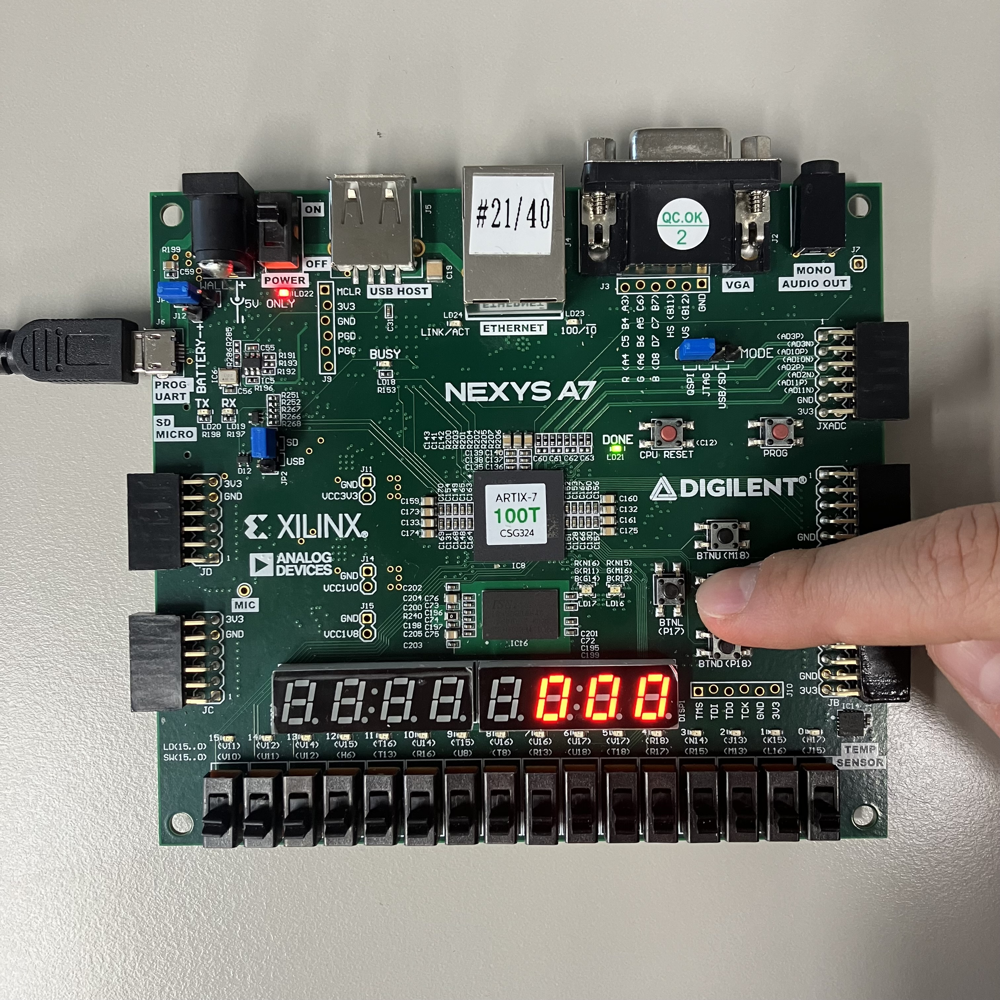
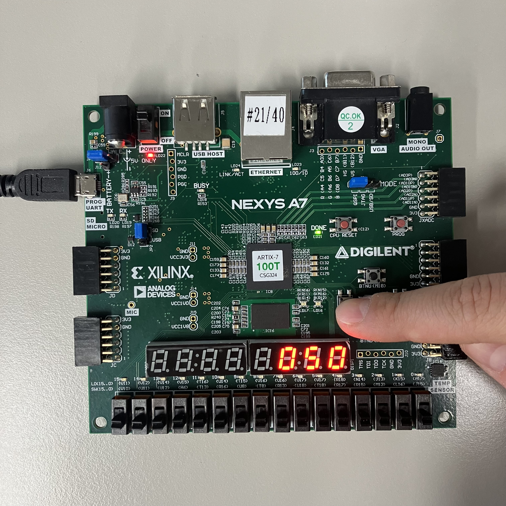
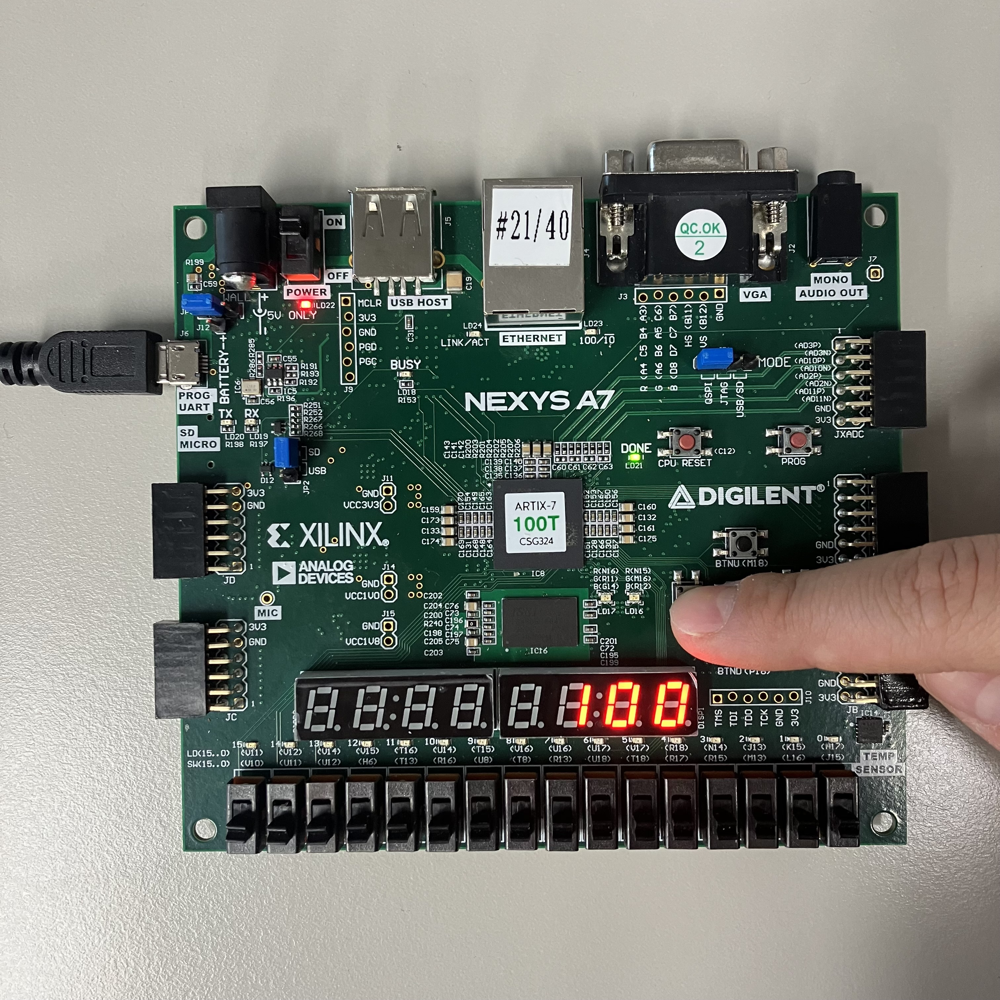

# Lab11_VendingMachine_7seg
다음은 VendingMachine 코드이다.

***
xdc 파일을 참고하면,

### #input

btnc: reset

btnl: coin_50

btnr: coin_100

clk: clock

### #output

led[0]: dispense (물건)

led[1]: remain (잔돈)

ssA-ssG: 7-segment display (active-low)

이 변수는 하나의 7segment display에 어디를 키고 끌 것인지 정한다.

AN0-7: anode signal (active-low)

이 변수는 여러 개의 7segment display 중 어떠한 것을 킬 것인지 정한다.

