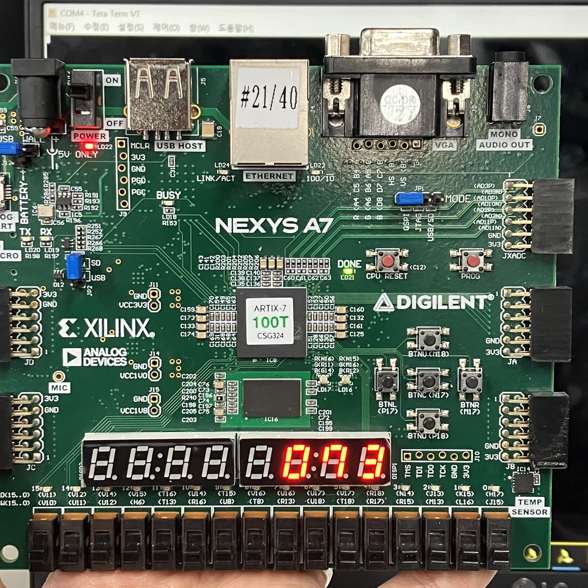

# Lab12_UART
다음은 UART 통신 코드이다.

Teraterm을 설치 후, 연결된 보드의 시리얼 포트를 맞춘다. 몇 가지 설정 후, 키보드의 입력에 맞게 보드의 7segment display에 ASCII 번호가 뜨는 것을 확인할 수 있다.
(자세한 작동 방식 및 설명은 pdf, ppt 참고)

xdc 파일을 참고하면,

input
btnc: reset
clk: clock

output
CA~CG: 7-segment display (active-low)
    이 변수는 하나의 7segment display에 어디를 키고 끌 것인지 정한다.
AN0~7: anode signal (active-low)
    이 변수는 여러 개의 7segment display 중 어떠한 것을 킬 것인지 정한다.
RxD,TxD: UART 통신을 위함.

