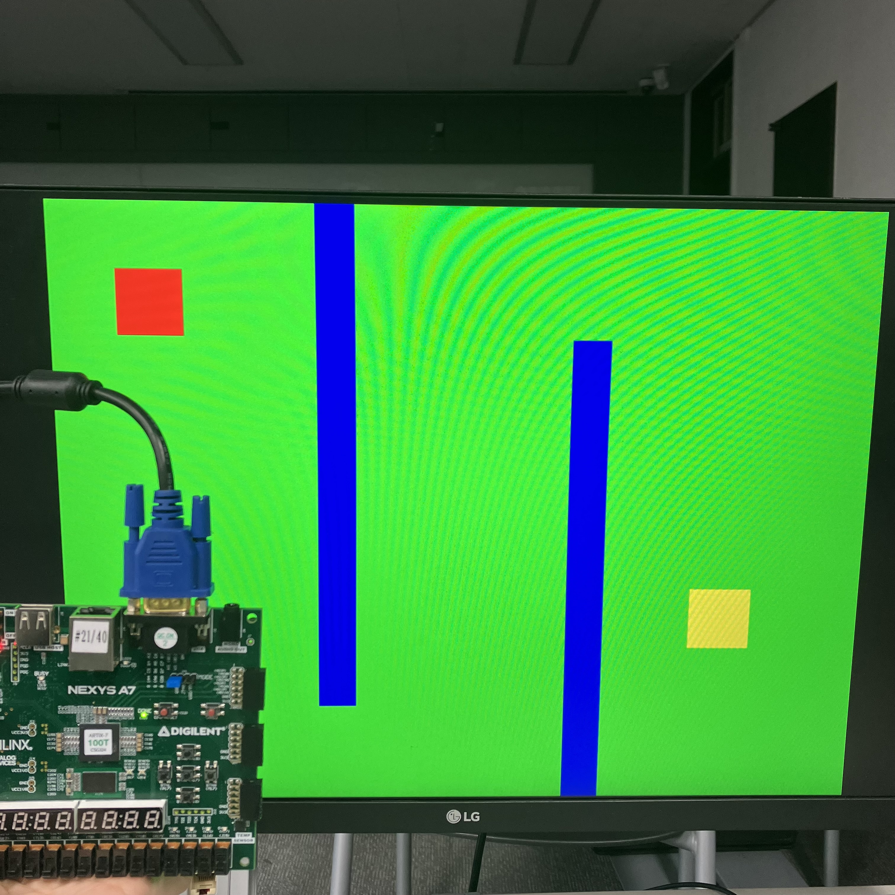

# Lab13_VGA
다음은 VGA 통신 코드이다.

보드의 RGB VGA선을 모니터에 연결 후 모니터 화면을 확인한다.

(자세한 작동 방식 및 설명은 pdf 참고)

xdc 파일을 참고하면,

input

btnc: reset

CLK100MHZ: clock

output

CA-CG: 7-segment display (active-low)

    이 변수는 하나의 7segment display에 어디를 키고 끌 것인지 정한다.

AN0-7: anode signal (active-low)

    이 변수는 여러 개의 7segment display 중 어떠한 것을 킬 것인지 정한다.

VGA_HS, VGA_VS: VGA 통신을 위한 수직, 수평 신호

vga[11:0]: VGA의 RGB 신호

