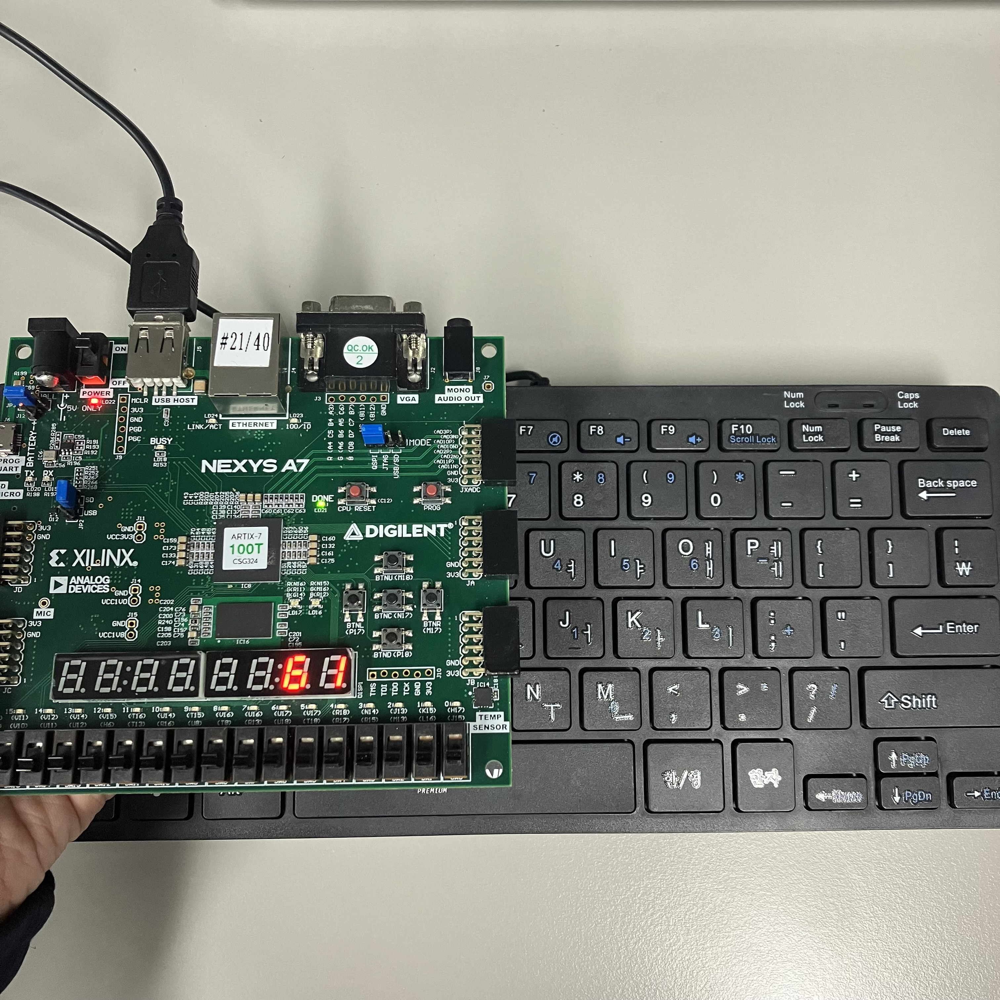

# Lab14_PS2Keyboard
다음은 PS2Keyboard 통신 코드이다.

보드의 USB Host에 키보드를 연결한다. 키보드의 입력에 맞게 보드의 7segment display에 ASCII 번호가 뜨는 것을 확인할 수 있다.

***
xdc 파일을 참고하면,

### #input

btnc: reset

clk: clock

### #output

sseg[6:0]: 7-segment display (active-low)

이 변수는 하나의 7segment display에 어디를 키고 끌 것인지 정한다.

ssDP: decimal point

AN[7:0]: anode signal (active-low)

이 변수는 여러 개의 7segment display 중 어떠한 것을 킬 것인지 정한다.

RxD,TxD: UART 통신을 위함.

 