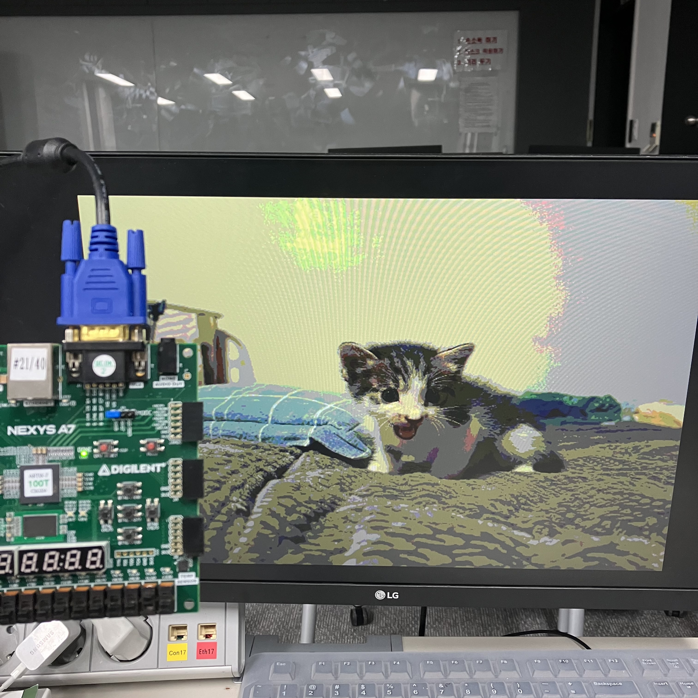
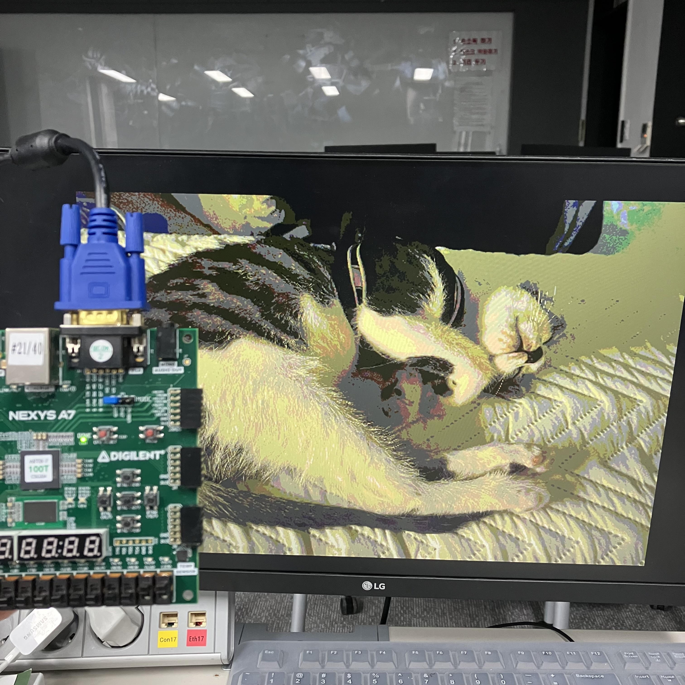

# Lab15_VGAwithBRAM_coefile2
다음은 VGA 통신 코드이다.

보드의 RGB VGA선을 모니터에 연결 후 모니터 화면을 확인한다. 스위치 입력에 따라 coe file이 변하고 Y-offset이 변한다.

xdc 파일을 참고하면,

input

btnc: reset

clk: clock

SW[3:1]: Y-offset 변경을 위한 신호

SW[0]: coe file 변경을 위한 신호

output

hsyncb, vsyncb: VGA 통신을 위한 수직, 수평 신호

VGA_R[3:0]: VGA의 R 신호

VGA_G[3:0]: VGA의 G 신호

VGA_B[3:0]: VGA의 B 신호

